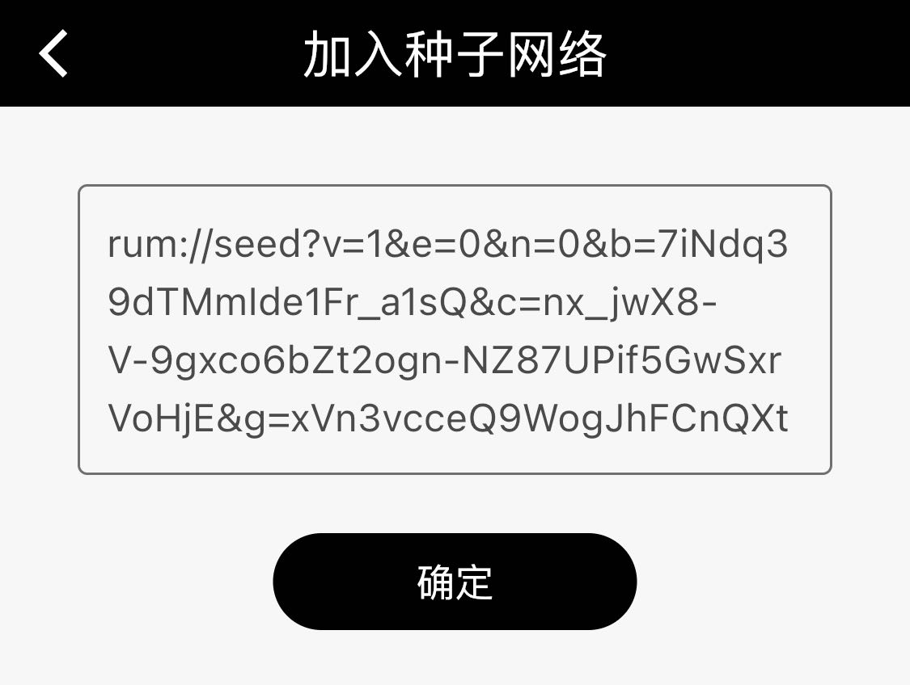

# Let's Rum

### Intro

<details>

<summary>Expand for introduction</summary>

#### Rum:

Rum is an open-source P2P application infrastructure to offer some internet alternatives. The official Rum team has developed decentralized applications (DApps) to meet different scenarios to demonstrate the many possibilities of the Rum System. It provides unlimited imagination for building an alternative Internet world.

[applications.md](applications.md "mention")


#### Node:

The nodes form the Rum Network, where full nodes can generate blocks and light nodes cannot. Besides, they can join the seed network to read data from the chain as well.


#### Rum System:

Rum System consists of Quorum and Rum Network. Go to the official web page [rumsystem.net](https://rumsystem.net) to learn more.&#x20;


#### SeedNet:

SeedNets provide content data for various Rum applications. The on-chain data is presented according to different usage scenarios, including blogs, forums, and chat rooms.

</details>

### Quick Start

#### 1. Our recommendations for new users:



Download the Mobile Light Node client:

**Click to download Android APK**


iPhone users need to install TestFlight first.

Click on this link to **open the installation page**&#x20;

Or

Scan the QR code with your mobile phone:

{二维码}



Click on the following link to download the full node Rum application:

1. Windows installation package, supporting Windows 7.0
2. MacOS installation package
3. Linux installer



#### 2. Copy the SeedNet text for joining {新版种子大全}

```
rum://seed?v=1&e=0&n=0&b=7iNdq39dTMmIde1Fr_a1sQ&c=nx_jwX8-V-9gxco6bZt2ogn-NZ87UPif5GwSxrVoHjE&g=xVn3vcceQ9WogJhFCnQXtA&k=A_iyXgC2kvs8EZjh0iNb6P12MqE2D3FbrsYJ5Vdow0tr&s=GTo9VYQMWWjca5UcY6ET28ijxOTWFHxk7BGOVyb2okNLmndy9vVjmiXQro6YWdczgryVYtoptU2G6BKc5QZJDQE&t=FwdrP2wzc9g&a=%E6%96%B0%E7%89%88%E7%A7%8D%E5%AD%90%E5%A4%A7%E5%85%A8&y=group_post&u=https%3A%2F%2F103.61.39.95%3Fjwt%3DeyJhbGciOiJIUzI1NiIsInR5cCI6IkpXVCJ9.eyJhbGxvd0dyb3VwcyI6WyJjNTU5ZjdiZC1jNzFlLTQzZDUtYTg4MC05ODQ1MGE3NDE3YjQiXSwiZXhwIjoxODE3MDkyOTEyLCJuYW1lIjoiYWxsb3ctYzU1OWY3YmQtYzcxZS00M2Q1LWE4ODAtOTg0NTBhNzQxN2I0Iiwicm9sZSI6Im5vZGUifQ.9-jFxogmNe1DlAJvfDUhR7ZdwKt6TY-ZqYab-sRFSBo
```

#### 3. Click on the plus sign in the Rum client, paste the text and join the SeedNet




**If it is a PC client, you have to wait for 5 minutes for the whole node to be synchronized.**


**Adventure the possibilities, bon voyage!**


Go to the next section \[Application Download] to discover more DApps built on RumSystem.

